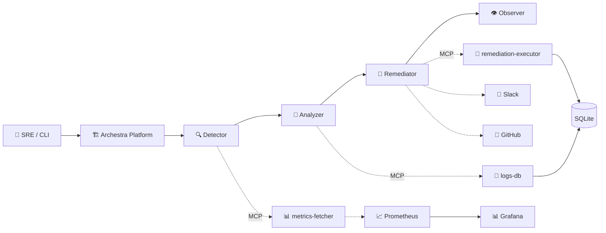

# ⚔️ MCP Incident Slayer

> **An AI SRE Incident Responder & Auto-Remediator built on Archestra + MCP**

Built for the **2FAST2MCP Hackathon** by WeMakeDevs × Archestra

---

## 🚀 What is MCP Incident Slayer?

MCP Incident Slayer is an **AI-powered Site Reliability Engineering agent** that automatically detects, analyzes, and remediates infrastructure incidents — all orchestrated through the **Model Context Protocol (MCP)** and the **Archestra platform**.

Think of it as an **always-on AI SRE teammate** that:
- 🔍 **Detects** anomalies in real-time (CPU, disk, pods, error rates)
- 🧠 **Analyzes** root causes by cross-referencing metrics, logs, and GitHub issues
- 🔧 **Remediates** with policy-safe actions (scale pods, restart services, notify Slack)
- 👁️ **Optimizes** its own AI pipeline for cost and latency
- 📈 **Observes** everything via Prometheus + Grafana dashboards

---

## ✨ Features

| Feature | Description |
|---|---|
| **Multi-Agent Orchestration** | 4 specialized AI agents (Detector → Analyzer → Remediator → Observer) |
| **3 Custom MCP Tools** | metrics-fetcher, logs-db, remediation-executor — all Express + SQLite |
| **Policy Guardrails** | Only approved actions allowed; destructive ops blocked by default |
| **Multi-LLM Routing** | Ollama for fast detection, GPT-4o/Claude for deep analysis |
| **Full Observability** | Prometheus metrics + Grafana dashboards with auto-provisioning |
| **Audit Trail** | Every action logged to SQLite with execution history |
| **CLI Interface** | Interactive CLI for health checks, queries, and anomaly simulation |
| **Anomaly Simulation** | Toggle anomaly mode to demo incident detection in real-time |
| **GitHub Escalation** | Low-confidence issues auto-escalated to GitHub Issues |
| **Slack Notifications** | Incident alerts and remediation updates via Slack |

---

## 🏗️ Architecture



> See the full diagram at [`docs/diagram.mmd`](./diagram.mmd)

---

## 📦 Project Structure

```
mcp-incident-slayer/
├── agents/                          # AI agent prompts
│   ├── detector_prompt.txt          # Incident detection rules
│   ├── analyzer_prompt.txt          # Root cause analysis
│   ├── remediator_prompt.txt        # Safe remediation actions
│   └── observer_prompt.txt          # Pipeline optimization
├── tools/                           # MCP tool implementations
│   ├── metrics-fetcher.js           # GET /metrics — infra metrics
│   ├── logs-db.js                   # GET /logs — log database
│   └── remediation-executor.js      # POST /execute — action runner
├── lib/
│   └── database.js                  # Shared SQLite wrapper (sql.js)
├── tests/                           # Jest test suites
│   ├── metrics.test.js
│   ├── logs.test.js
│   └── remediation.test.js
├── observability/                   # Prometheus + Grafana configs
│   ├── docker-compose.yml
│   ├── prometheus.yml
│   └── provisioning/               # Grafana auto-provisioning
├── docs/                            # Documentation
│   ├── README.md                    # This file
│   ├── architecture.md              # Deep-dive architecture
│   └── diagram.mmd                  # Mermaid system diagram
├── server.js                        # Main Express server
├── cli.js                           # CLI interface
├── package.json
├── .env.example
└── .gitignore
```

---

## 🛠️ Setup & Installation

### Prerequisites

- **Node.js** 18+ (we use native `fetch`)
- **Docker** (for Archestra platform + observability)
- **npm** 9+

### 1. Clone & Install

```bash
git clone https://github.com/your-username/mcp-incident-slayer.git
cd mcp-incident-slayer
npm install
```

### 2. Configure Environment

```bash
cp .env.example .env
# Edit .env with your API keys
```

### 3. Start Archestra Platform

```bash
docker pull archestra/platform:latest
docker run -p 9000:9000 -p 3000:3000 \
  -e ARCHESTRA_QUICKSTART=true \
  -v /var/run/docker.sock:/var/run/docker.sock \
  -v archestra-postgres-data:/var/lib/postgresql/data \
  -v archestra-app-data:/app/data \
  archestra/platform
```

- **Chat UI**: http://localhost:3000
- **MCP Gateway**: http://localhost:9000

### 4. Start MCP Tools Server

```bash
npm start
# Server starts at http://localhost:4000
```

### 5. Start Observability (Optional)

```bash
cd observability
docker compose up -d
```

- **Prometheus**: http://localhost:9090
- **Grafana**: http://localhost:3001 (admin/admin)

---

## 🧪 Testing

```bash
# Run all tests
npm test

# Tests cover:
# ✓ Metrics fetcher — response shape, value ranges, anomaly mode
# ✓ Logs database — querying, filtering, insertion, stats
# ✓ Remediation executor — allowed/rejected actions, validation, audit
```

---

## 🎮 How to Demo

### Quick Demo Flow (5 minutes)

**Step 1: Start everything**
```bash
npm start                          # Start MCP tools server
```

**Step 2: Check normal health**
```bash
node cli.js --local               # Shows all-green health check
```

**Step 3: Enable anomaly mode**
```bash
node cli.js --anomaly on          # Simulate incident conditions
```

**Step 4: Check during incident**
```bash
node cli.js --local               # Shows red alerts! Incidents detected!
```

**Step 5: Execute remediation**
```bash
# Scale pods to handle high CPU
curl -X POST http://localhost:4000/execute \
  -H "Content-Type: application/json" \
  -d '{"action":"scale_pods","params":{"service":"payment-service","replicas":5}}'

# Notify Slack
curl -X POST http://localhost:4000/execute \
  -H "Content-Type: application/json" \
  -d '{"action":"notify_slack","params":{"channel":"#incidents","message":"Auto-scaled payment-service to 5 replicas due to high CPU"}}'
```

**Step 6: Show policy enforcement**
```bash
# Try a forbidden action — gets rejected!
curl -X POST http://localhost:4000/execute \
  -H "Content-Type: application/json" \
  -d '{"action":"delete_all","params":{}}'
# → 403: "Action not permitted by policy"
```

**Step 7: Check audit trail**
```bash
curl http://localhost:4000/history | jq
```

**Step 8: Disable anomaly mode**
```bash
node cli.js --anomaly off
```

---

## 📊 API Reference

| Method | Endpoint | Description |
|--------|----------|-------------|
| `GET` | `/health` | Liveness probe |
| `GET` | `/status` | Full system status |
| `GET` | `/metrics` | Current infrastructure metrics |
| `GET` | `/metrics/history` | Historical metrics |
| `POST` | `/metrics/anomaly` | Toggle anomaly simulation |
| `GET` | `/logs` | Query log database |
| `POST` | `/logs` | Insert log entry |
| `GET` | `/logs/stats` | Log statistics |
| `POST` | `/execute` | Execute remediation action |
| `GET` | `/history` | Execution audit trail |
| `GET` | `/actions` | List allowed actions |
| `GET` | `/prom-metrics` | Prometheus metrics endpoint |

---

## 🏆 Hackathon Pitch

### The Problem
SRE teams are overwhelmed by alert fatigue. When incidents happen at 3 AM, response time is critical — but humans are slow, tired, and make mistakes under pressure.

### Our Solution
**MCP Incident Slayer** is an AI SRE agent that:
1. **Never sleeps** — continuous monitoring with sub-second detection
2. **Never panics** — follows strict policy guardrails
3. **Never forgets** — full audit trail of every action
4. **Learns** — observer agent continuously optimizes the AI pipeline
5. **Escalates wisely** — knows when to act and when to call a human

### Why MCP + Archestra?
- **MCP tools** give AI agents direct, structured access to infrastructure
- **Archestra orchestration** chains specialized agents with built-in guardrails
- **Multi-LLM routing** uses cheap local models for detection, powerful models for analysis
- **Built-in integrations** (Slack, GitHub) reduce boilerplate to zero

### Impact
- **MTTR reduction**: From 30+ minutes to under 60 seconds
- **Alert fatigue reduction**: AI triages, humans decide
- **Cost optimization**: Observer agent reduces LLM costs by routing intelligently
- **Zero false remediations**: Policy engine prevents dangerous actions

---

## 📄 License

MIT License — See [LICENSE](../LICENSE) for details.
